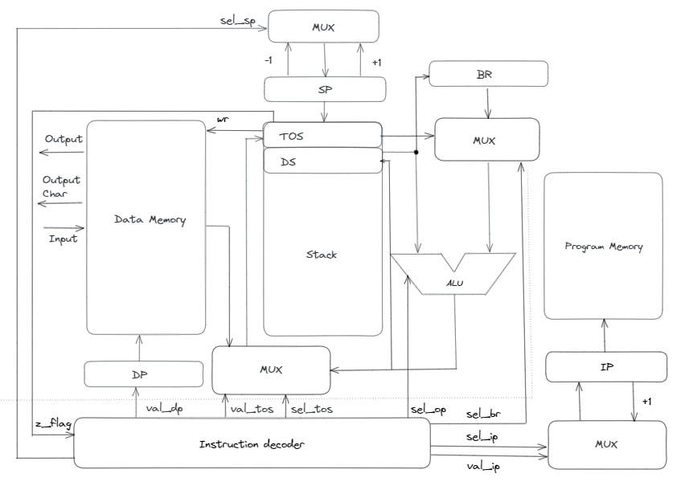

# Архитектура компьютера
# Лабораторная работа №3

- Колесникова Светлана, гр. P33301
- `forth | stack | harv | hw | instr | binary | stream | mem | prob2`

## Язык программирования

``` ebnf
<program> :: = <words> "\n" <program> | <words>
<words> ::= <number> | <command>
<number> ::= [1-9][0-9]+
<command> ::= "+" | "-" | "*" | "div" | "mod" | "=" 
                  |">" | "<" | "drop" | "dup" | "dup_d" | "." 
                  | "exit" |  <var> <var_command>| <if>
                  
<var_command> ::= "!" | "@"
<loop> ::= "begin" "\n" <words> "\n" "until"
<if> ::= "if" "\n" <words> "\n" "endif"
<var> ::= "variable" <name>
<name> ::= ([A-Z] | [a-z])+


```
Примечания:
- Используется обратная польская нотация.
- Основной объект действия команд - стек
- Все команды разделены переносом строки (каждая строка рассматривается как отдельная операция)

#### Операции:

| Операция | Стек                       | Описание |
| -------- | -------------------------- | -------- |
| +        | ...  a  b --> ...  a + b   | Складывает два первых операнда и возвращает сумму на вершину |
| -        | ...  a  b --> ...  a - b   | Вычитает b из a и возвращает разность на вершину |
| *        | ...  a  b --> ...  a * b   | Умножает два первых операнда и возвращает сумму на вершину |
| div      | ...  a  b --> ...  a div b | Делит a на b и возвращает целую часть на вершину |
| mod      | ...  a  b --> ...  a mod b | Делит a на b и возвращает остаток на вершину |
| >        | ...  a  b --> ...  a > b   | Проверяет, что a больше b. Возвращает на вершину 1 если истина, иначе - 0 |
| <        | ...  a  b --> ...  a < b   | Проверяет, что a меньше b. Возвращает на вершину 1 если истина, иначе - 0 |
| =        | ...  a  b --> ...  a = b   | Проверяет, что a равно b. Возвращает на вершину 1 если истина, иначе - 0 |
| dup      | ...  a  --> ...  a a       | Копирует a на вершину |
| dup_d    | ...  a  b --> ...  a b a b | Копирует a и b и возвращает на вершину в том же порядке |
| drop     | ...  a  b --> ...  a       | Удаляет b со стека |
| .        | ...  a --> ...             | Выводит вершину стека в output |
| ,        | ...  a --> ...             | Выводит вершину стека в output как символ|
| !        | ...  a addr --> ...        | Сохраняет a по адресу addr в памяти|
| @        | addr --> ... a             | Считывает значение из памяти данных по адресу addr и возвращает его на вершину|
| #        | --> ... а                  | Считывает значение из input|
| exit     | -                          | Завершает выполнение программы |


Переменные
+ Объявления переменной - `variable <имя>`
+ Получение значения переменной - `<имя> @`
+ Запись значения в переменную - `<имя> !` (значение берется с вершины стека)

Циклы
+ `begin ... until` -- прекращается, когда until забирает со стека единицу

Условные операторы
+ `if ... endif` -- условие выполняется, если if берет со стека 1

## Кодирование инструкций

Формат кодирования - бинарный.
Старшие 8 бит отведены под код команды, 7й бит указывает на тип команды (1 - адресная, 0 - безадресная)

| Мнемоника | Бинарный формат | Кол-во тактов | Комментарий |
| --------- | --------------- | ------------- | ----------- |
| EXIT      | 00000000        | 0             |  Останов           |
| ADD       | 00000010        | 2             |  см. язык           |
| SUB       | 00000100        | 2             |  см. язык           |
| MUL       | 00000110        | 2             |  см. язык           |
| DIV       | 00001000        | 2             |  см. язык           |
| MOD       | 00001010        | 2             |  см. язык           |
| GR        | 00001100        | 2             |  см. язык           |
| LESS      | 00001110        | 2             |  см. язык           |
| EQ        | 00010000        | 2             |  см. язык           |
| DROP      | 00010010        | 1             |  см. язык           |
| DUP       | 00010100        | 2             |  см. язык           |
| DUP_D     | 00010110        | 6             |  см. язык           |
| PUSH      | 00011000        | 2             |  см. язык          |
| POP       | 00011011        | 3             |  см. язык           |
| GET       | 00011101        | 3             |  см. язык           |
| JMP       | 00011111        | 1             |  Безусловный переход           |
| BZ        | 00100001        | 1             |  Переход если на вершине 0           |
| BNZ       | 00100011        | 1             |  Переход если на вершине не 0           |
| VAR       | 00100101        | -             |  Метка для переменных           |
| LINK      | 00100111        | -             |  Метка для ссылок           |

## Транслятор

Интерфейс командной строки: `translator.py <input_file.forth> <output_file.bin> <output_file.mnem>`

Реализовано в модуле: [translator](translator.py)

Этапы трансляции:
1. Проверка корректности программы
2. Установка заглушек с метками для адресных команд
3. Генерация машинного кода

## Модель процессора

Интерфейс командной строки: machine.py <parsed_file> <input_file>

Реализовано в модуле: [machine](machine.py)

Имеется разделение на DataPath и ControlUnit.



Сигналы (обрабатываются за один такт, реализованы в виде методов DataPath):
+ latch_tos - изменить значение на вершине стека
+ latch_ds  - изменить 2 значение на вершине стека
+ latch_sp - сдвинуть указатель вершины стека
+ latch_dr - защелкнуть адрес в памяти DataPath
+ latch_ip - выполняется в ControlUnit, меняет адрес текущей команды (переход)

Флаги:

+ Z - На вершине стека находится ноль

Моделирование производилось на уровне инструкций.
Трансляция инструкций в последовательность сигналов - decode_and_execute.

Особенности модели:

+ Для журналирования используется модуль `logging`.
+ Количество исполненных операций ограничено константой.
+ Остановка модуляции определяется по возвращаемому значению функции.
+ Запуск симуляции происходит при вызове функции `simulate`.

## Апробация

Для тестов использовано несколько алгоритмов:

1. [Hello World](examples/hello.forth)
2. [Cat](examples/cat.forth)
3. [Even Fibonacci numbers](examples/prob2.forth)

Пример использования и журнал работы процессора на примере [Cat](examples/cat.forth):

```example
$ cat examples/input.txt
dlrow olleH

$ cat examples/cat.forth
begin
#
dup
.
0
=
until

$ python translator.py examples/cat.forth examples/cat.bin examples/cat.mnem
source LoC: 7 code instr: 7

$cat examples/cat.mnem 
LINK @1
GET @var2
DUP
POP @var0
PUSH 0
EQ
BZ @1

$ python machine.py examples/cat.bin examples/input.txt
DEBUG:root:GET 2 TICK: 0, IP: 0, ADDR: 3, TOS: 0, DS: 0
DEBUG:root:DUP 0 TICK: 3, IP: 1, ADDR: 2, TOS: H, DS: 0
DEBUG:root:POP 0 TICK: 5, IP: 2, ADDR: 2, TOS: H, DS: H
DEBUG:root:PUSH 0 TICK: 8, IP: 3, ADDR: 0, TOS: H, DS: 0
DEBUG:root:EQ 0 TICK: 10, IP: 4, ADDR: 0, TOS: 0, DS: H
DEBUG:root:BZ 0 TICK: 12, IP: 5, ADDR: 0, TOS: 0, DS: 0
DEBUG:root:GET 2 TICK: 13, IP: 0, ADDR: 0, TOS: 0, DS: 0
DEBUG:root:DUP 0 TICK: 16, IP: 1, ADDR: 2, TOS: e, DS: 0
DEBUG:root:POP 0 TICK: 18, IP: 2, ADDR: 2, TOS: e, DS: e
DEBUG:root:PUSH 0 TICK: 21, IP: 3, ADDR: 0, TOS: e, DS: 0
DEBUG:root:EQ 0 TICK: 23, IP: 4, ADDR: 0, TOS: 0, DS: e
DEBUG:root:BZ 0 TICK: 25, IP: 5, ADDR: 0, TOS: 0, DS: 0
DEBUG:root:GET 2 TICK: 26, IP: 0, ADDR: 0, TOS: 0, DS: 0
DEBUG:root:DUP 0 TICK: 29, IP: 1, ADDR: 2, TOS: l, DS: 0
DEBUG:root:POP 0 TICK: 31, IP: 2, ADDR: 2, TOS: l, DS: l
DEBUG:root:PUSH 0 TICK: 34, IP: 3, ADDR: 0, TOS: l, DS: 0
DEBUG:root:EQ 0 TICK: 36, IP: 4, ADDR: 0, TOS: 0, DS: l
DEBUG:root:BZ 0 TICK: 38, IP: 5, ADDR: 0, TOS: 0, DS: 0
DEBUG:root:GET 2 TICK: 39, IP: 0, ADDR: 0, TOS: 0, DS: 0
DEBUG:root:DUP 0 TICK: 42, IP: 1, ADDR: 2, TOS: l, DS: 0
DEBUG:root:POP 0 TICK: 44, IP: 2, ADDR: 2, TOS: l, DS: l
DEBUG:root:PUSH 0 TICK: 47, IP: 3, ADDR: 0, TOS: l, DS: 0
DEBUG:root:EQ 0 TICK: 49, IP: 4, ADDR: 0, TOS: 0, DS: l
DEBUG:root:BZ 0 TICK: 51, IP: 5, ADDR: 0, TOS: 0, DS: 0
DEBUG:root:GET 2 TICK: 52, IP: 0, ADDR: 0, TOS: 0, DS: 0
DEBUG:root:DUP 0 TICK: 55, IP: 1, ADDR: 2, TOS: o, DS: 0
DEBUG:root:POP 0 TICK: 57, IP: 2, ADDR: 2, TOS: o, DS: o
DEBUG:root:PUSH 0 TICK: 60, IP: 3, ADDR: 0, TOS: o, DS: 0
DEBUG:root:EQ 0 TICK: 62, IP: 4, ADDR: 0, TOS: 0, DS: o
DEBUG:root:BZ 0 TICK: 64, IP: 5, ADDR: 0, TOS: 0, DS: 0
DEBUG:root:GET 2 TICK: 65, IP: 0, ADDR: 0, TOS: 0, DS: 0
DEBUG:root:DUP 0 TICK: 68, IP: 1, ADDR: 2, TOS:  , DS: 0
DEBUG:root:POP 0 TICK: 70, IP: 2, ADDR: 2, TOS:  , DS:  
DEBUG:root:PUSH 0 TICK: 73, IP: 3, ADDR: 0, TOS:  , DS: 0
DEBUG:root:EQ 0 TICK: 75, IP: 4, ADDR: 0, TOS: 0, DS:  
DEBUG:root:BZ 0 TICK: 77, IP: 5, ADDR: 0, TOS: 0, DS: 0
DEBUG:root:GET 2 TICK: 78, IP: 0, ADDR: 0, TOS: 0, DS: 0
DEBUG:root:DUP 0 TICK: 81, IP: 1, ADDR: 2, TOS: w, DS: 0
DEBUG:root:POP 0 TICK: 83, IP: 2, ADDR: 2, TOS: w, DS: w
DEBUG:root:PUSH 0 TICK: 86, IP: 3, ADDR: 0, TOS: w, DS: 0
DEBUG:root:EQ 0 TICK: 88, IP: 4, ADDR: 0, TOS: 0, DS: w
DEBUG:root:BZ 0 TICK: 90, IP: 5, ADDR: 0, TOS: 0, DS: 0
DEBUG:root:GET 2 TICK: 91, IP: 0, ADDR: 0, TOS: 0, DS: 0
DEBUG:root:DUP 0 TICK: 94, IP: 1, ADDR: 2, TOS: o, DS: 0
DEBUG:root:POP 0 TICK: 96, IP: 2, ADDR: 2, TOS: o, DS: o
DEBUG:root:PUSH 0 TICK: 99, IP: 3, ADDR: 0, TOS: o, DS: 0
DEBUG:root:EQ 0 TICK: 101, IP: 4, ADDR: 0, TOS: 0, DS: o
DEBUG:root:BZ 0 TICK: 103, IP: 5, ADDR: 0, TOS: 0, DS: 0
DEBUG:root:GET 2 TICK: 104, IP: 0, ADDR: 0, TOS: 0, DS: 0
DEBUG:root:DUP 0 TICK: 107, IP: 1, ADDR: 2, TOS: r, DS: 0
DEBUG:root:POP 0 TICK: 109, IP: 2, ADDR: 2, TOS: r, DS: r
DEBUG:root:PUSH 0 TICK: 112, IP: 3, ADDR: 0, TOS: r, DS: 0
DEBUG:root:EQ 0 TICK: 114, IP: 4, ADDR: 0, TOS: 0, DS: r
DEBUG:root:BZ 0 TICK: 116, IP: 5, ADDR: 0, TOS: 0, DS: 0
DEBUG:root:GET 2 TICK: 117, IP: 0, ADDR: 0, TOS: 0, DS: 0
DEBUG:root:DUP 0 TICK: 120, IP: 1, ADDR: 2, TOS: l, DS: 0
DEBUG:root:POP 0 TICK: 122, IP: 2, ADDR: 2, TOS: l, DS: l
DEBUG:root:PUSH 0 TICK: 125, IP: 3, ADDR: 0, TOS: l, DS: 0
DEBUG:root:EQ 0 TICK: 127, IP: 4, ADDR: 0, TOS: 0, DS: l
DEBUG:root:BZ 0 TICK: 129, IP: 5, ADDR: 0, TOS: 0, DS: 0
DEBUG:root:GET 2 TICK: 130, IP: 0, ADDR: 0, TOS: 0, DS: 0
DEBUG:root:DUP 0 TICK: 133, IP: 1, ADDR: 2, TOS: d, DS: 0
DEBUG:root:POP 0 TICK: 135, IP: 2, ADDR: 2, TOS: d, DS: d
DEBUG:root:PUSH 0 TICK: 138, IP: 3, ADDR: 0, TOS: d, DS: 0
DEBUG:root:EQ 0 TICK: 140, IP: 4, ADDR: 0, TOS: 0, DS: d
DEBUG:root:BZ 0 TICK: 142, IP: 5, ADDR: 0, TOS: 0, DS: 0
DEBUG:root:GET 2 TICK: 143, IP: 0, ADDR: 0, TOS: 0, DS: 0
WARNING:root:Input buffer is empty!
INFO:root:output_buffer: 'Hello world'
Hello world
instr_counter:  66 ticks: 145


```

| ФИО               | алг.  | LoC | code байт | code инстр. | инстр. | такт. | вариант |
|-------------------|-------|-----|-----------|-------------|--------|-------|---------|
| Колесникова С.А.  | hello | 24  |           | 24          | 23     | 58    | -       |
| Колесникова С.А.  | cat   | 7   |           | 7           | 24     | 54    | -       |
| Колесникова С.А.  | prob2 | 26  |           | 26          | 422    | 931   | -       |